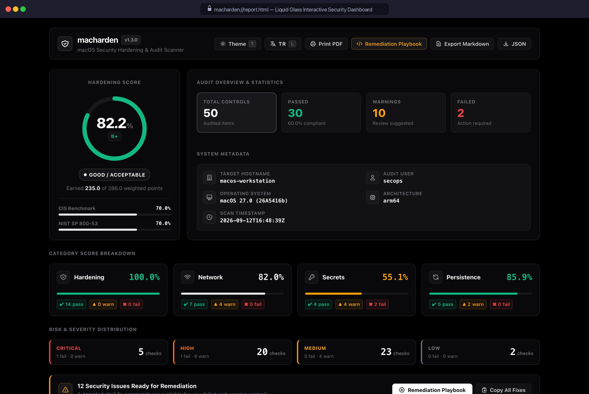

# 🛡️ macharden

<p align="center">
  <strong>Enterprise-Grade macOS Security Hardening, Baseline Drift & Audit Engine</strong><br>
  <em>Zero dependencies • Pure native Zsh/Bash • 54 CIS/NIST security controls • OASIS SARIF v2.1.0 • Liquid Glass HTML5</em>
</p>

<p align="center">
  <a href="https://github.com/jankesec/macharden/stargazers"></a>
  <a href="https://github.com/jankesec/macharden/network/members"></a>
  <a href="https://github.com/jankesec/macharden/actions/workflows/ci.yml"></a>
  <a href="https://github.com/jankesec/macharden/releases/latest"></a>
  <a href="#-license"></a>
  <a href="https://apple.com/macos"></a>
  <a href="#"></a>
  <a href="#-audit-categories--54-security-rules"></a>
  <a href="#-regulatory-compliance-mappings"></a>
  <a href="#"></a>
</p>

---

## 🎬 Live Terminal & Interactive Dashboard Demo

<p align="center">
  
</p>
<p align="center"><em>Live terminal audit across all 4 security domains, weighted Hardening Index, category posture breakdown, high-priority remediation actions, and instant single-file Liquid Glass HTML5 report export. Pure native Zsh execution with zero external dependencies.</em></p>

---

## 📖 Overview

**macharden** is an enterprise-grade security audit, posture assessment, and automated hardening scanner engineered specifically for macOS (macOS 12 Monterey through macOS 15 Sequoia and macOS 26/27+, natively supporting both Apple Silicon and Intel architectures).

Unlike generic Unix scanners that treat macOS as a generic BSD derivative, **macharden** deeply inspects Apple's proprietary security subsystems:
- **System Integrity Protection (SIP)** & Authenticated Root (`csrutil`)
- **FileVault 2 XTS-AES disk encryption** (`fdesetup`)
- **Gatekeeper code signing and notarization** assessments (`spctl`)
- **Application Firewall** configuration, stealth mode & interpreter exceptions (`socketfilterfw`)
- **OpenBSM Auditing & ACL immutability**: Audit daemon status (`com.apple.auditd`), `/etc/security/audit_control` permissions, and `/var/audit` directory & trail ACL stripping (CIS 3.1–3.5 / NIST AU-9 / NIST mSCP)
- **Keychain inactivity lock timeouts** & core dump restrictions
- **BPF raw packet capture permissions** (`/dev/bpf*` and `access_bpf` group)
- **LaunchAgents & LaunchDaemons** binary integrity & signature verification
- **Secrets scanning**: Plaintext API tokens in shell startup profiles (`~/.zshrc`, `~/.bashrc`), shell history (`.zsh_history`), exposed `.env` files, and cloud credential stores (`~/.aws/credentials`, `~/.kube/config`, `~/.docker/config.json`)
- **Privilege escalation & persistence**: Insecure `$PATH` hijacking vectors, sudoers `NOPASSWD` entries, login items, cron jobs, periodic scripts, and SSH `authorized_keys` backdoors

---

## ✨ Key Capabilities

| Capability | Description |
|:---|:---|
| ⚡ **Zero Dependencies** | Written in pure, native **Zsh/Bash**. Requires no Homebrew, Python libraries, Ruby, Gems, or Node.js runtimes. |
| 🎯 **54 Audited Controls** | Comprehensive security coverage across 4 domains: System Hardening (21), Network (12), Secrets (11), and Persistence (10). |
| 📊 **Hardening Index (0–100%)** | Objective, mathematically weighted scoring formula with letter grades (`A+` to `F`) and category-level posture bars. |
| 📉 **Baseline Drift & Diff Engine** | Historical security tracking (`--diff <baseline.json>`). Detects regressions and security posture decay between scans. |
| 🚪 **CI/CD Quality Gate** | Seamless DevSecOps integration via `--fail-on-regression` (**exit code 2**) and `--min-score <N>` (**exit code 1**). |
| 🛡️ **OASIS SARIF v2.1.0** | Native integration with GitHub Advanced Security (Code Scanning tab), GitLab SAST, DefectDojo, and SIEM pipelines. |
| 💎 **Liquid Glass HTML5 Dashboard** | Standalone, single-file interactive dashboard with zero external CDN dependencies, search, filters, and Dark/Light modes. |
| 🌐 **Bilingual (EN / TR)** | Complete native English and Turkish language support across Terminal, HTML dashboard, Markdown reports, and SARIF tags. |
| 🔧 **Risk-Aware Remediation** | Only explicitly typed `[EXEC]` actions can run; `[GUIDE]` items stay manual. Includes interactive remediation (`--fix`), dry-run preview, executable playbooks, and rollback. |
| 🎛️ **Tailored Baselines** | Lynis-style profiles support skipped controls plus mSCP-style organization-defined values (ODVs), so user-impacting policy is never silently imposed. |
| 📜 **Regulatory Compliance** | Direct control mapping to **CIS Apple macOS Benchmark**, **NIST SP 800-53 Rev 5**, and **MITRE ATT&CK Matrix for macOS**. |

---

## 🥊 Why macharden? (Competitive Comparison)

Security engineers and Mac administrators often ask why they should choose `macharden` over generic Unix scanners or heavyweight compliance suites:

| Feature / Capability | 🛡️ **macharden** | **Lynis** | **Apple mSCP** | **CIS-CAT Pro** |
|:---|:---:|:---:|:---:|:---:|
| **Runtime Dependencies** | **Zero (Native Zsh/Bash)** | Python / Perl plugins | Python, Ruby, Git | Java Runtime (JRE 11+) |
| **macOS First & Architecture** | **macOS 12–15+ (Apple Silicon & Intel)** | Linux-first (generic BSD checks) | macOS only | Cross-platform |
| **Native Security Subsystems** | **Deep (SIP, FileVault, BPF, OpenBSM, Launchd)** | Basic Unix file permissions | MDM Configuration Profiles | Benchmark XML rules |
| **Interactive HTML5 Dashboard** | **Yes (Liquid Glass, 0 CDN, Dark/Light)** | No (Text / Paid Enterprise) | No (Static AsciiDoc/HTML) | Basic HTML table |
| **GitHub Security SARIF v2.1.0** | **Native out-of-the-box** | Third-party converters | No | Commercial add-on |
| **Historical Drift & CI/CD Gate** | **Built-in (`--diff`, `--fail-on-regression`)** | Manual log comparisons | No | Enterprise server |
| **Remediation & Rollback** | **Yes (`--fix`, `--dry-run`, `--undo`)** | Suggestion text only | Script generation (MDM) | Bash scripts (often risky) |
| **Multi-Language Support** | **English & Turkish (Native i18n)** | English only | English only | English only |
| **Execution Speed** | **Sub-second (~0.8s for 54 controls)** | 10–30 seconds | Minutes (profile compile) | 2–5 minutes |
| **Licensing** | **MIT (100% Free & Open Source)** | GPLv3 / Enterprise Paywall | Public Domain | Commercial / Paid CIS Membership |

---

## 💎 Liquid Glass HTML5 Dashboard

Generate an interactive, single-file HTML5 security dashboard with **zero external CDN links, zero web fonts, and zero tracking**:

```bash
macharden -f html -o report.html && open report.html
```

<p align="center">
  
</p>

### Dashboard Features:
* **Interactive Filtering**: Filter findings in real time by Domain (*Hardening, Network, Secrets, Persistence*), Status (*Pass, Warn, Fail*), Severity (*Critical, High, Medium, Low*), or Regulatory Framework (*CIS, NIST, MITRE*).
* **Keyboard Shortcuts**:
  * `/` : Instant search bar focus
  * `L` : Instant language toggle (**English ⇄ Turkish**) without page reload
  * `T` : Theme toggle (**Dark Glass ⇄ Light Mode**)
  * `Esc` : Close modals / clear search
* **Remediation Playbook Modal**: In-browser interactive drawer displaying the exact shell commands needed to remediate findings, with one-click copy and script download.
* **Export Actions**: Export directly from the browser to **Markdown**, **JSON**, **OASIS SARIF**, or **Print-optimized PDF**.

---


## 🚀 Quick Start

### 1. One-Liner Quick Scan (Direct Execution)

Run an immediate, read-only security audit in your terminal without cloning:

```bash
curl -fsSL https://raw.githubusercontent.com/jankesec/macharden/main/bin/macharden | zsh
```

### 2. Clone & Run

```bash
# Clone repository
git clone https://github.com/jankesec/macharden.git
cd macharden

# Execute full 54-control security audit
./bin/macharden
```

### 3. System-Wide Installation

```bash
# Install binary, shell autocompletions (Zsh & Bash), and UNIX man page
make install

# Or install individual components:
make install-completions   # Zsh (_macharden) & Bash autocompletions
make install-man           # UNIX manual page (man macharden)
```

*(Installs binary to `/usr/local/bin` or `~/.local/bin`, completions to Zsh/Bash site-functions, and manual page to `share/man/man1/macharden.1`)*

### 4. Tailor a Baseline

Copy `examples/macharden.prf` and select values that match the Mac's role and threat model:

```ini
profile-name=Developer Workstation
machine-role=workstation

# Explicitly retain normal login-keychain behavior:
keychain-timeout=none
keychain-lock-on-sleep=no

# Or require a reviewed 15-minute policy (never auto-applied):
# keychain-timeout=900
# keychain-lock-on-sleep=yes

skip-test=HARD-08
```

```bash
macharden --profile ./developer.prf
```

Keychain timeout changes are guidance-only because they can cause recurring password prompts. The Keychain check evaluates the selected baseline while leaving this user-impacting choice to the operator.

---

## 📚 Documentation

- **[User Guide](docs/USER-GUIDE.md)** — installation, first audit, profiles, reports, remediation review, drift detection, scheduled scans, privacy, and troubleshooting.
- **[Architecture](docs/ARCHITECTURE.md)** — runtime flow, scoring model, trust boundaries, remediation contract, and upstream reference provenance.
- **[Manual Page](docs/macharden.1)** — complete command and option reference for `man macharden`.
- **[Changelog](CHANGELOG.md)** — release history and notable security, privacy, and usability changes.

---

## 📈 Baseline Drift & CI/CD Security Gates

Prevent security regressions across developer laptops and macOS CI runners with historical baseline tracking:

```bash
# 1. Establish an initial baseline snapshot on a hardened system:
macharden -f json -o baseline.json

# 2. Run future scans and inspect drift deltas:
macharden --diff baseline.json

# 3. Enforce CI/CD security gate (fails with exit code 2 if security degrades):
macharden --diff baseline.json --fail-on-regression
```

### Executive Drift Terminal Output:
```text
======================================================================
                  BASELINE DRIFT & SECURITY DIFF
======================================================================
  Baseline Scan : 2026-09-01 10:00:00 UTC (Host: macos-workstation)
  Current Scan  : 2026-09-12 12:00:00 UTC (Host: macos-workstation)
  Baseline Score: 85.0% (B+)
  Current Score : 79.5% (C+)
  Score Drift   : -5.5% [▼ REGRESSED]

  Regressions   : 2 new failing/warning check(s)
  Remediations  : 1 previously failed check(s) resolved

▶ Security Regressions (Action Required):
  [FAIL]  HARD-02  FileVault Full Disk Encryption (was PASS)
  [WARN]  NET-03   Firewall Permissive Exceptions (was PASS)

▶ Remediated Checks (Resolved):
  [PASS]  SEC-01   Plaintext API Keys in Shell Profiles (was FAIL)
```

### GitHub Actions CI/CD Integration Workflow

Add `macharden` to your repository's `.github/workflows/security.yml` to automatically audit macOS runner environments and upload findings to the GitHub Security tab:

```yaml
name: macOS Security Hardening Audit

on:
  push:
    branches: [ main ]
  schedule:
    - cron: '0 0 * * 1'  # Weekly scan

jobs:
  audit:
    name: Audit macOS Security Posture
    runs-on: macos-latest
    steps:
      - name: Checkout Code
        uses: actions/checkout@v4

      - name: Install macharden
        run: |
          git clone https://github.com/jankesec/macharden.git ~/.macharden-tool
          echo "$HOME/.macharden-tool/bin" >> $GITHUB_PATH

      - name: Run macharden Audit Scan
        run: |
          macharden -f sarif -o macharden-results.sarif -q || true

      - name: Upload SARIF to GitHub Code Scanning
        uses: github/codeql-action/upload-sarif@v3
        with:
          sarif_file: macharden-results.sarif
          category: macharden-macos
```

---

## 📊 Multi-Format Reporting

Generate rich, purpose-built reports for security engineers, executive leadership, and automated pipelines:

```bash
# Liquid Glass HTML5 Dashboard (zero CDN dependencies, bilingual with 'L' key):
macharden -f html -o report.html && open report.html

# OASIS SARIF v2.1.0 for GitHub Code Scanning / Advanced Security:
macharden -f sarif -o report.sarif

# GitHub-flavored Markdown for pull requests and issue trackers:
macharden -f markdown -o report.md

# Machine-readable JSON for SIEM / Splunk / Elastic ingestion:
macharden -f json -o report.json
```

---

## 💻 CLI Command Reference

```text
macharden - macOS Security Hardening & Audit Scanner (v1.4.0)

Usage:
  macharden [options]

Core Options:
  -h, --help                 Display usage information and exit
  -v, --version              Print version information (v1.4.0)
  -c, --category <name>      Run category: hardening, network, secrets, persistence, all
  -f, --format <format>      Output format: term, markdown, json, html, sarif (default: term)
  -o, --output <file>        Save audit report to file (auto-detects format from extension)
  -q, --quiet                Minimal output, display executive summary only
  -l, --lang <en|tr>         Interface language (English or Turkish; default: en)
  --no-color                 Disable ANSI terminal color output

Baseline & Quality Gates:
  --diff <baseline.json>     Compare audit against historical baseline snapshot
  --fail-on-regression       Exit with code 2 if security posture has regressed
  --min-score <0-100>        Exit with code 1 if Hardening Index is below threshold
  --fail-on-warn             Treat warnings as failures in exit status

Remediation & Safety:
  --fix                      Interactively prompt and apply remediation fixes
  --dry-run                  Preview remediation commands without executing them
  --undo                     Rollback previous automated remediation actions
  --generate-fix [file]      Generate automated remediation shell script without applying

Filtering & Continuous Monitoring:
  --skip-test <id>[,id...]   Skip specific check IDs (e.g. --skip-test HARD-08,PERS-04)
  --profile <file>           Load skip-test configurations from profile
  --compliance <framework>   Filter report by regulatory framework (cis, nist, mitre, all)
  --daemon-install [sched]   Install background LaunchAgent (daily, weekly, monthly, on-login)
  --daemon-uninstall         Unload and remove background scan LaunchAgent
  --daemon-status            Inspect background daemon status and recent logs
  --alert                    Trigger native macOS notification on critical findings
```

---

## 🔍 Audit Categories & 54 Security Rules

`macharden` evaluates **54 security controls** mapped to authoritative benchmarks:

### 1. 🛡️ System Hardening (`hardening` - 21 Controls)
| &nbsp;&nbsp;&nbsp;&nbsp;Check&nbsp;ID&nbsp;&nbsp;&nbsp;&nbsp; | Control Title | CIS Benchmark | NIST 800-53 | MITRE ATT&CK | Weight |
|:---|:---|:---:|:---:|:---:|:---:|
| <code>HARD&#8209;01</code> | System Integrity Protection (SIP) | CIS 5.1.2 | SI-7 | T1562.001 | 10 |
| <code>HARD&#8209;02</code> | FileVault 2 Full Disk Encryption | CIS 2.5.1 | SC-28 | T1552.001 | 10 |
| <code>HARD&#8209;03</code> | Gatekeeper Code Assessment Verification | CIS 5.2.1 | CM-6 | T1204.002 | 10 |
| <code>HARD&#8209;04</code> | Screen Saver Lock & Delay | CIS 2.3.1 | AC-11 | T1056.002 | 7 |
| <code>HARD&#8209;05</code> | Guest Account Status | CIS 5.7 | AC-2 | T1078.003 | 6 |
| <code>HARD&#8209;06</code> | Automatic Software Updates | CIS 1.2 | SI-2 | T1190 | 6 |
| <code>HARD&#8209;07</code> | Remote Sharing Services Attack Surface | CIS 2.2.1 | AC-3 | T1021.002 | 7 |
| <code>HARD&#8209;08</code> | Firmware Password / Recovery Lock | CIS 2.5.2 | IA-2 | T1542.001 | 8 |
| <code>HARD&#8209;09</code> | Secure Boot & Authenticated Root | CIS 5.1.1 | SI-7 | T1542.001 | 8 |
| <code>HARD&#8209;10</code> | Automatic Login Disabled | CIS 5.8 | IA-2 | T1078.003 | 6 |
| <code>HARD&#8209;11</code> | Bluetooth File Sharing Exposure | CIS 2.1.2 | AC-18 | T1011 | 5 |
| <code>HARD&#8209;12</code> | Home Directory Permissions (`$HOME` 700) | CIS 5.1.4 | AC-6 | T1083 | 6 |
| <code>HARD&#8209;13</code> | Network Time Synchronization (NTP) | CIS 1.1 | AU-8 | T1070.006 | 5 |
| <code>HARD&#8209;14</code> | Built-in Malware Protection (XProtect/MRT) | CIS 2.4.1 | SI-3 | T1562.001 | 6 |
| <code>HARD&#8209;15</code> | USB Restricted Mode | CIS 2.4.4 | MP-7 | T1091 | 5 |
| <code>HARD&#8209;16</code> | Apple Diagnostic & Telemetry Sharing | CIS 2.6.1 | AU-12 | T1020 | 4 |
| <code>HARD&#8209;17</code> | AirDrop Discoverability Exposure | CIS 2.1.1 | AC-18 | T1011 | 6 |
| <code>HARD&#8209;18</code> | OpenBSM Security Auditing Daemon Status | CIS 3.1 | AU-12 | T1562.001 | 8 |
| <code>HARD&#8209;19</code> | Audit Control Configuration Ownership & Permissions | CIS 3.2 | AU-9 | T1565.001 | 7 |
| <code>HARD&#8209;20</code> | Audit Log Files & Directory ACL Immutability | CIS 3.5 | AU-9 | T1070 | 9 |
| <code>HARD&#8209;21</code> | Audit Trail Event Flags & Retention Policy | CIS 3.4 | AU-11 | T1562.001 | 6 |

### 2. 🌐 Network & Perimeter Security (`network` - 12 Controls)
| &nbsp;&nbsp;&nbsp;&nbsp;Check&nbsp;ID&nbsp;&nbsp;&nbsp;&nbsp; | Control Title | CIS Benchmark | NIST 800-53 | MITRE ATT&CK | Weight |
|:---|:---|:---:|:---:|:---:|:---:|
| <code>NET&#8209;01</code> | Application Firewall Global State | CIS 2.4.2 | SC-7 | T1562.004 | 8 |
| <code>NET&#8209;02</code> | Firewall Stealth Mode | CIS 2.4.3 | SC-7 | T1046 | 5 |
| <code>NET&#8209;03</code> | Dangerous Firewall Interpreter Exceptions | CIS 2.4.2 | CM-7 | T1059.006 | 8 |
| <code>NET&#8209;04</code> | BPF Packet Capture Permissions (`/dev/bpf*`) | CIS 5.1.5 | AC-6 | T1040 | 7 |
| <code>NET&#8209;05</code> | `/etc/hosts` Loopback Integrity | CIS 5.1.3 | SC-20 | T1565.001 | 9 |
| <code>NET&#8209;06</code> | Listening Wildcard TCP Services (`0.0.0.0`) | CIS 2.2.2 | SC-7 | T1043 | 6 |
| <code>NET&#8209;07</code> | AirDrop Radio Service State | CIS 2.1.1 | AC-18 | T1011 | 6 |
| <code>NET&#8209;08</code> | Internet Sharing & NAT Daemons | CIS 2.2.3 | AC-4 | T1090 | 7 |
| <code>NET&#8209;09</code> | Application Firewall Logging Mode | CIS 2.4.2 | AU-2 | T1562.004 | 4 |
| <code>NET&#8209;10</code> | IP Forwarding Routing Subsystem | CIS 2.2.4 | SC-7 | T1090 | 7 |
| <code>NET&#8209;11</code> | Promiscuous Network Interfaces | CIS 2.4.5 | AU-12 | T1040 | 6 |
| <code>NET&#8209;12</code> | Wi-Fi Open Network Auto-Join | CIS 2.1.3 | AC-18 | T1040 | 6 |

### 3. 🔑 Secrets, Keys & Credentials (`secrets` - 11 Controls)
| &nbsp;&nbsp;&nbsp;&nbsp;Check&nbsp;ID&nbsp;&nbsp;&nbsp;&nbsp; | Control Title | CIS Benchmark | NIST 800-53 | MITRE ATT&CK | Weight |
|:---|:---|:---:|:---:|:---:|:---:|
| <code>SEC&#8209;01</code> | Plaintext API Keys in Shell Profiles | CIS 5.1.6 | IA-5 | T1552.001 | 9 |
| <code>SEC&#8209;02</code> | Exposed World-Readable `.env` Files | CIS 5.1.7 | SC-28 | T1552.001 | 6 |
| <code>SEC&#8209;03</code> | Keychain Inactivity Lock Timeout | CIS 2.3.2 | AC-11 | T1555.001 | 5 |
| <code>SEC&#8209;04</code> | Kernel Crash Core Dumps (`kern.coredump`) | CIS 5.5 | SC-28 | T1005 | 5 |
| <code>SEC&#8209;05</code> | SSH Keys and Config File Permissions | CIS 5.1.8 | AC-6 | T1552.004 | 7 |
| <code>SEC&#8209;06</code> | Unencrypted SSH Private Keys | CIS 5.1.9 | IA-5 | T1552.004 | 8 |
| <code>SEC&#8209;07</code> | Secrets Leaked in Shell History Files | CIS 5.1.10 | IA-5 | T1552.003 | 7 |
| <code>SEC&#8209;08</code> | SSH Daemon Configuration Hardening | CIS 5.2.2 | AC-3 | T1021.004 | 7 |
| <code>SEC&#8209;09</code> | Suspicious Shell History Symlink Targets | CIS 5.1.11 | SI-4 | T1070.003 | 5 |
| <code>SEC&#8209;10</code> | Insecure & World-Writable `$PATH` Directories | CIS 5.1.12 | CM-6 | T1574.007 | 7 |
| <code>SEC&#8209;11</code> | Cloud & API Credentials Permissions (`.aws`, `.kube`, `.docker`) | CIS 5.1.13 | AC-6 | T1552.001 | 8 |

### 4. ⚙️ Persistence & Daemons (`persistence` - 10 Controls)
| &nbsp;&nbsp;&nbsp;&nbsp;Check&nbsp;ID&nbsp;&nbsp;&nbsp;&nbsp; | Control Title | CIS Benchmark | NIST 800-53 | MITRE ATT&CK | Weight |
|:---|:---|:---:|:---:|:---:|:---:|
| <code>PERS&#8209;01</code> | User & System LaunchAgents Integrity | CIS 5.3.1 | CM-6 | T1543.001 | 7 |
| <code>PERS&#8209;02</code> | System LaunchDaemons Review & Signature | CIS 5.3.2 | CM-6 | T1543.004 | 7 |
| <code>PERS&#8209;03</code> | Scheduled Cron Jobs Inspection | CIS 5.3.3 | CM-6 | T1053.003 | 6 |
| <code>PERS&#8209;04</code> | macOS Login Items Persistence | CIS 5.3.4 | CM-6 | T1547.015 | 5 |
| <code>PERS&#8209;05</code> | SSH `authorized_keys` Backdoor Audit | CIS 5.3.5 | AC-3 | T1098.004 | 7 |
| <code>PERS&#8209;06</code> | Sudoers `NOPASSWD` Privilege Escalation | CIS 5.4 | AC-6 | T1548.003 | 8 |
| <code>PERS&#8209;07</code> | Privileged Helper Tools Integrity | CIS 5.3.6 | SI-7 | T1543.004 | 6 |
| <code>PERS&#8209;08</code> | CUPS Printer Sharing Remote Vector | CIS 2.2.5 | CM-7 | T1021 | 5 |
| <code>PERS&#8209;09</code> | Sudo Authentication Ticket Timeout | CIS 5.4.1 | AC-11 | T1548.003 | 5 |
| <code>PERS&#8209;10</code> | Periodic Maintenance Scripts (`/etc/periodic`) | CIS 5.3.7 | SI-4 | T1053.003 | 7 |

---

## 📁 Repository Structure

```
macharden/
├── bin/
│   └── macharden                  # Unified CLI executable & scanner entrypoint
├── lib/
│   ├── audit_hardening.sh         # 21 macOS system & kernel hardening checks
│   ├── audit_network.sh           # 12 network, socket & packet capture checks
│   ├── audit_secrets.sh           # 11 secret leak, cloud credential & PATH checks
│   ├── audit_persistence.sh       # 10 persistence, launchd & cron checks
│   ├── compliance.sh              # CIS, NIST, and MITRE posture calculators
│   ├── diff.sh                    # Historical baseline drift & regression engine
│   ├── engine.sh                  # Weighted scoring formula & check registry
│   ├── i18n.sh                    # Localization runtime (English & Turkish)
│   ├── monitor.sh                 # Continuous LaunchAgent daemon & alerting
│   ├── remediate.sh               # Remediation playbook, dry-run & rollback engine
│   ├── report.sh                  # Terminal & Markdown executive report generators
│   ├── report_html.sh             # Liquid Glass single-file HTML5 dashboard
│   ├── report_sarif.sh            # OASIS SARIF v2.1.0 generator (GitHub Code Scanning)
│   └── ui.sh                      # ANSI terminal engine, progress bars & score boxes
├── data/
│   ├── compliance_mappings.json   # 54 controls mapped to CIS, NIST, MITRE & docs
│   └── locales/
│       └── tr.json                # Authentic Turkish cybersecurity terminology
├── assets/
│   ├── demo.gif                   # Privacy-safe terminal + dashboard demo
│   ├── demo.tape                  # Reproducible VHS terminal capture source
│   └── dashboard.png              # High-resolution HTML5 dashboard preview
├── completions/
│   ├── macharden.zsh              # Native Zsh completion definition
│   └── macharden.bash             # Native Bash completion definition
├── docs/
│   ├── ARCHITECTURE.md            # Runtime, scoring, safety & provenance design
│   ├── USER-GUIDE.md              # Installation and operational usage guide
│   └── macharden.1                # Standard UNIX manual page (groff man format)
├── scripts/
│   ├── demo_fixture.sh            # Deterministic synthetic demo data
│   └── generate_demo_gif.py       # High-fidelity GIF rendering pipeline
├── launchd/
│   └── com.macharden.daemon.plist # Launchd template for background audits
├── tests/
│   ├── test_runner.sh             # Master test suite runner
│   ├── test_checks.sh             # Unit tests, schema verifiers & CLI tests
│   └── test_mocks.sh              # Mocked system checks validation
├── .github/
│   └── workflows/ci.yml           # Cross-platform GitHub Actions CI pipeline
├── Makefile                       # Unified build, test, lint, and install targets
├── LICENSE                        # MIT License
└── SECURITY.md                    # Vulnerability reporting & responsible disclosure policy
```

---

## 🧪 Quality Assurance & CI Matrix

`macharden` is verified continuously on every pull request and commit across dual-platform GitHub Actions runners:

| Test Gate / Verification | Runner Platform | Standard & Tooling | Result |
|:---|:---|:---|:---:|
| **Cross-Platform Syntax Validation** | macOS 14/15 & Ubuntu 24.04 | All 36 shell scripts validated with `zsh -n` and `bash -n` | **36 / 36 Passing** |
| **Static Shell Analysis** | macOS 14/15 & Ubuntu 24.04 | ShellCheck linting across binary, libraries, and tests | **0 Errors** |
| **Automated Unit Tests** | macOS 14/15 & Ubuntu 24.04 | 301 unit tests covering engine scoring, parsers, and reports | **301 / 301 Passing** |
| **Mocked System Audit Logic** | macOS 14/15 & Ubuntu 24.04 | Mocked system checks verifying real audit branch behavior | **8 / 8 Passing** |
| **JSON & SARIF Validation** | macOS 14/15 & Ubuntu 24.04 | Schema validation via `python3 -m json.tool` & SARIF 2.1.0 spec | **Verified** |
| **Embedded In-Browser JavaScript** | macOS 14/15 & Ubuntu 24.04 | Client-side dashboard scripts validated with `node -c` | **Verified** |
| **Air-Gapped Privacy Invariant** | macOS 14/15 & Ubuntu 24.04 | Zero external CDN links, zero web fonts, zero tracking | **Verified (0 links)** |

```bash
# Execute local test suite:
make test
```

---

## ⭐ Star History & Community Support

If you find **macharden** valuable for securing your Mac, your fleet, or your enterprise endpoints, please consider starring the repository! It helps the project reach more security engineers and macOS defenders.

<p align="center">
  <a href="https://star-history.com/#jankesec/macharden&Date">
    
  </a>
</p>

---

## 🔐 Cryptographic Identity & Verification

**macharden** is researched and developed by Sevban Dönmez for enterprise endpoint defense, defensive telemetry auditing, and system security research.

```text
Author          : Sevban Dönmez (@jankesec)
Role            : Senior Cyber Security Consultant · Red Team & Offensive Security Researcher
Research Portal : https://jankesec.com
GitHub          : https://github.com/jankesec
PGP Fingerprint : FF0A 7D83 6751 CCE3 F9CC F574 FCF8 39FB 7F00 4626
GPG Key ID      : 5FDB257F4AAE8C3F
```

---

## ⚠️ Disclaimer

This tool is designed and distributed **exclusively for authorized security audits, endpoint hardening, defensive posture assessment, and academic research**. Applying automated remediation commands may alter system preferences, firewall configurations, and background services. Always review generated remediation scripts before applying them in mission-critical production environments. The author assumes no liability for unintended configuration changes or service disruption.

---

## 📜 License

Distributed under the **MIT License**. See [`LICENSE`](LICENSE) for complete terms.

<p align="center">
  <a href="https://www.buymeacoffee.com/sevbandonmez">
    
  </a>
</p>
